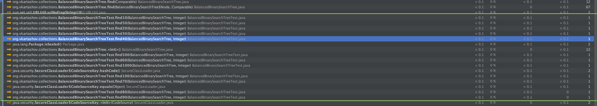
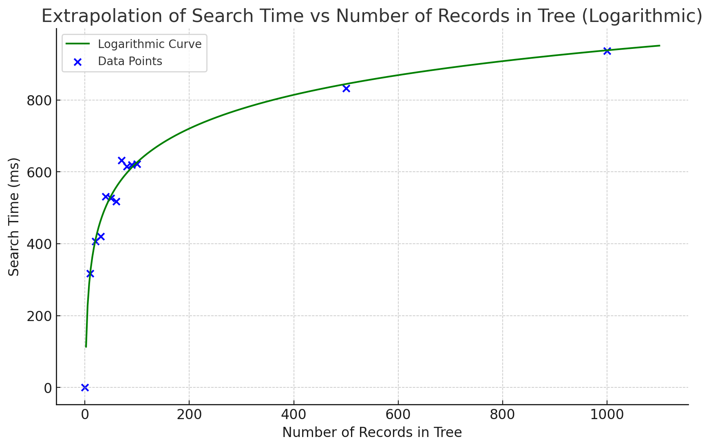

# hla25 Profiling

## BST and Counting Sort
Operation Tree Profiling

Implement Balanced Binary Search Tree class and operations of insert/delete/search  
Profile space usage ( Confirm that you see O (n) )  
Profile time consumption ( Confirm that you see O (log n))  

### Binary search tree
Implementation is used from [hla20](https://github.com/vadym-kartashov/hla20-data-structures-and-algorithms) homework
For this homework tree is being balanced before testing execution time
### Java Profiler
Java has built in profiling functionality which performs pretty well in case of debugging microservices or macroservices.
However for monoliths it is not the best option, in my experience they are not able to capture snapshot for app that use
more than 16GB of memory. Here are some of java profilers available:
1) VisualVM - bundled with JDK and free to use even for commercial products
2) JMC and Flight Recorder - bundled with JDK, more advanced functionality but requires license for commercial use
3) YourKit - commercial profiler, has free trial. Performs well heave monoloths

For this homework Yourkit has been chosen.

Initial setup requires to have YourKit agent attached to JVM. This can be done by adding following line to VM options:

Profiler captures call graph as well as flat profiling data

### Profile time consumption
To automate test - the separate methods have been added for each size of data volume
However testing on regular tree implementation didnt work since each of operations took less than 1ms and in yourkit
there is no way to measure time less than 1ms.

To overcome this issue - each call of recursive find method is delayed for 1000ms

Having this data extrapolated on logarithmic curve

### Profile space usage
Yourkit has strong capabilities to profile memory usage. It is possible to track memory allocated within call graph for
each individual method

In this case we could take tree sizes up to 100 elements. Extrapolation result is linear (close to linear):
