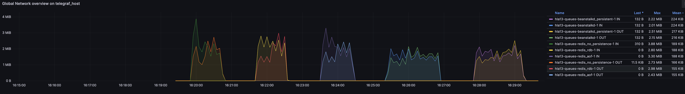
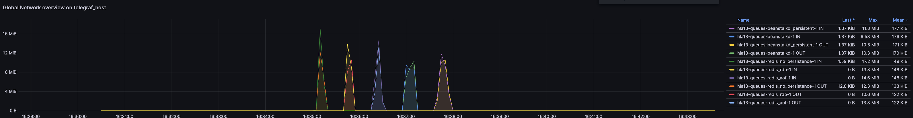
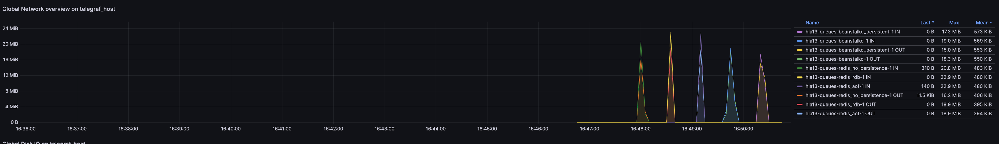
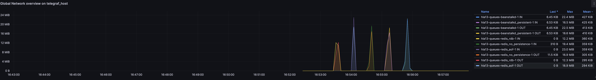

# hla13-queues
## Redis vs Beanstalkd

Set up 3 containers - beanstalkd and redis (rdb and aof)

Write 2 simple scripts: 1st should put message into queue, 2nd should read from queue.

Configure storing to disk,

Сompare queues performance.

## Implementation 

5 containers have been prepared: 3 for Redis (no persistence, RDB, AOF) and 2 for Beanstalkd (with and without persistence)  
Test has been prepared on 50000 records with 4 different concurrency levels (1, 10, 30, 50)

## Performance Metrics

| Queue System                     | Write op/sec (1) | Read op/sec (1) | Write op/sec (10) | Read op/sec (10) | Write op/sec (30) | Read op/sec (30) | Write op/sec (50) | Read op/sec (50) |
|---------------------------------|------------------|-----------|-------------------|------------|-------------|------------|-------------|------------|
| Redis (no persistence)           | 2110.24          | 1898.76   | 15792.80          | 15974.44   | 27056.28    | 27762.35   | 34722.22    | 34458.99   |
| Redis (RDB)                      | 1913.44          | 2092.40   | 14667.06          | 15948.96   | 21349.27    | 27979.85   | 29411.76    | 33760.97   |
| Redis (AOF)                      | 2013.77          | 1806.75   | 13304.95          | 12141.82   | 25799.79    | 28868.36   | 31525.85    | 34458.99   |
| Beanstalkd                       | 1542.16          | 916.24    | 10817.83          | 5936.83    | 20064.21    | 11008.37   | 23969.32    | 12846.87   |
| Beanstalkd (persist)             | 1678.13          | 968.94    | 11576.75          | 5995.20    | 17908.31    | 10599.96   | 20153.16    | 11873.66   |

Network usage with concurrency 1:

Network usage with concurrency 10:

Network usage with concurrency 30:

Network usage with concurrency 50:
