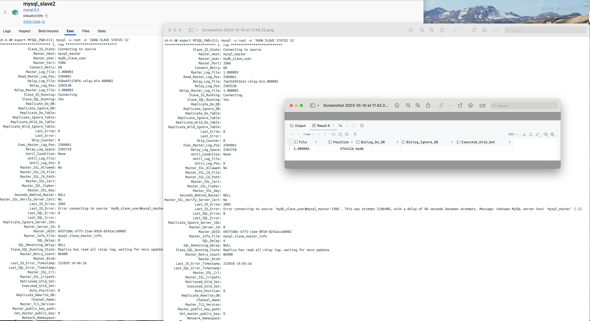
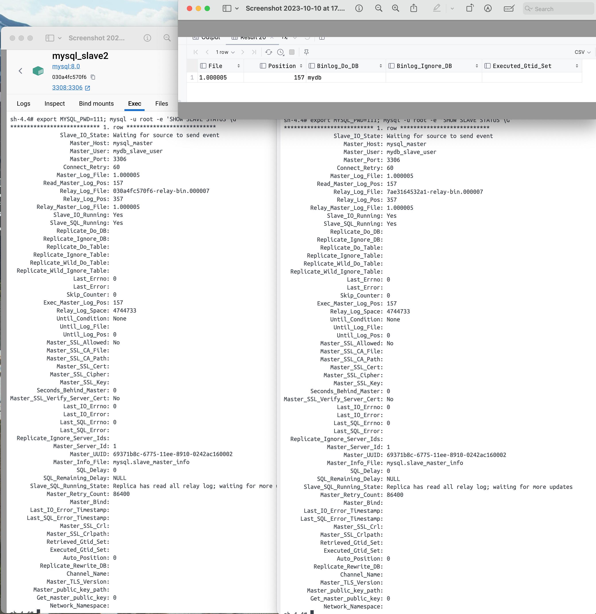
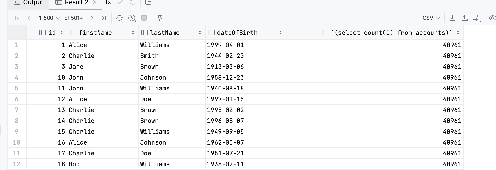

## hla21-replication Set up MySQL Cluster

- Create 3 docker containers: mysql-m, mysql-s1, mysql-s2
- Setup master slave replication (Master: mysql-m, Slave: mysql-s1, mysql-s2)
- Write script that will frequently write data to database
- Ensure, that replication is working
- Try to turn off mysql-s1, 
- Try to remove a column in database on slave node (try to delete last column and column from the middle)

## Solution

[docker-mysql-master-slave](https://github.com/vbabak/docker-mysql-master-slave) has been used
as a base for this solution. In addition one slave has been added with own configuration under
docker-compose file. Whole master-slave setup is done within [build.sh](./build.sh) script.
Database is being filled with data from [main.py](./main.py) python script.
To test if replication is working following steps are done:
1) 2 slaves has been shut down
2) master as been filled with data , master status has been taken
3) master down / slaves up and slaves status has been taken
4) up master and check if slaves are filled up with data
#### Steps 2-3

#### Step 4

### Remove middle and last column
1) 2 slaves has been shut down
2) master as been filled with data
3) master down / slaves up , last column has been deleted from slave1 , middle column has been deleted from slave2
4) master up and check how replication works.
#### Result:
- slave1 continued replication, no columns are shifted

- slave2 stopped replication, no columns are shifted
