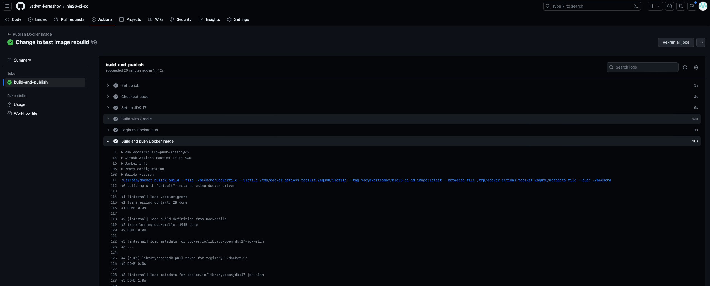

## hla25-ci-cd CI/CD for Search

Setup CI/CD for your pet project or project  based on laradock

## CI/CD Setup
For continuous integration and continuous delivery we will use GitHub Actions  
CI/CD is configured within [file](.github/workflows/build-and-publish.yml) and consists of following steps:
1) Build java project with gradle (includes unit tests running)
2) Build docker image
3) Push docker image to docker hub
Github action is triggered on every push to main branch (including merge of pull requests)  
Image could be deployed to AWS cloud or within local environment later on
