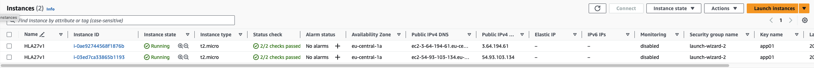
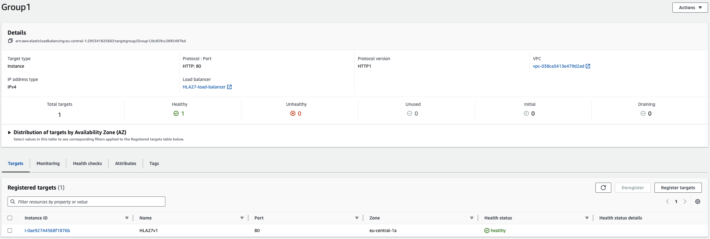
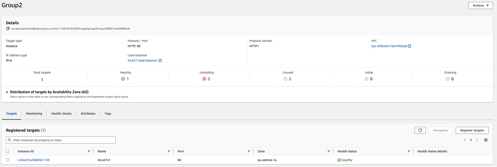
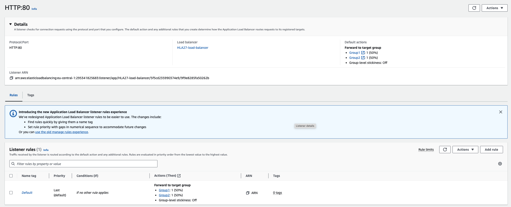
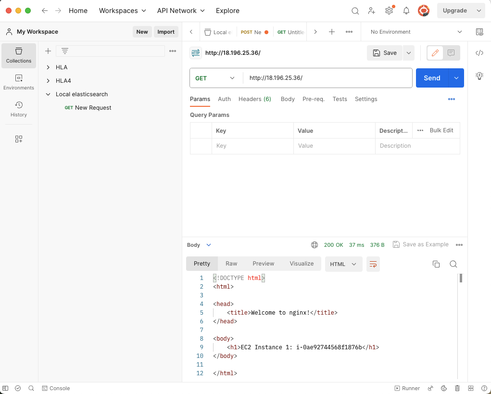
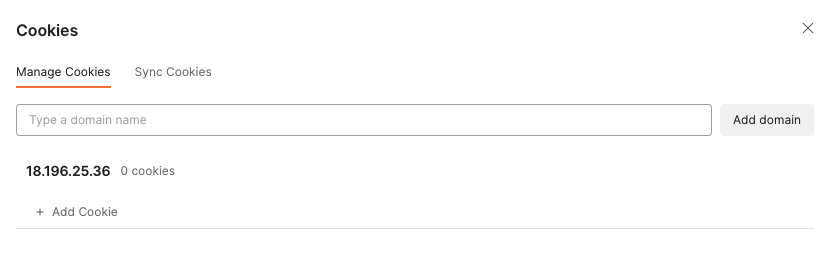
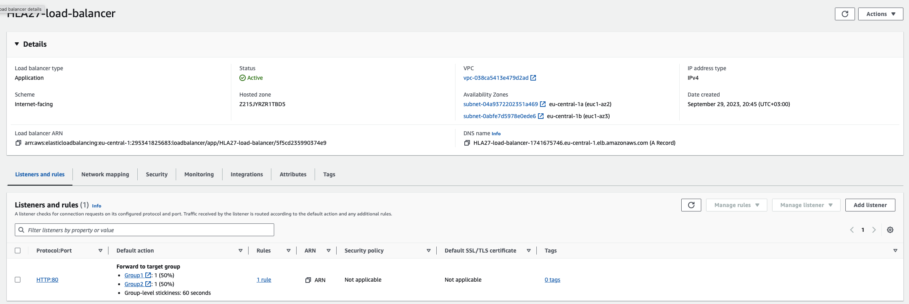
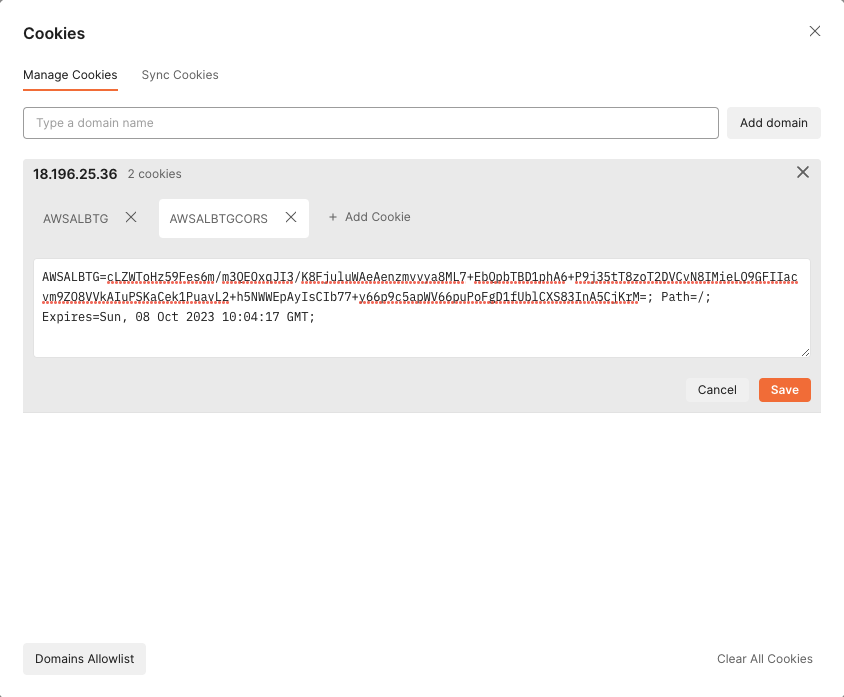

# hla25-aws-ec2-elb

## Simple Setup

Create 2 micro instances in AWS
Setup application load balancer and assign instances to it
Try Round Robin and sticky sessions load balancing alogrithms

## AWS Configuration
AWS is configured with 2 instances and 2 target groups 
#### EC2 instances configuration:

#### Target group 1 configuration:

#### Target group 2 configuration:

## AWS Load Balancer with Round Robin algorithm configuration and test
By default all requests are distributed between instances with round robin algorithm
#### Load balancer default configuration:

#### Request to load balancer:

#### Cookies saved after response (No cookies saved since in round robin case there is no need in them):

## AWS Load Balancer with sticky sessions configuration
Sticky sessions are configured with 1 minute timeout. AWS load balance is using AWSLBTG cookie in order to identify is request should 'stick' to the same instance. 
#### Load balancer configuration:

#### Request to load balancer:

#### Cookies saved after response:
