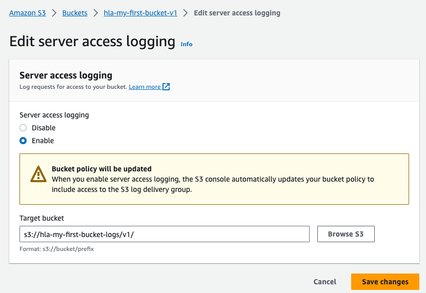
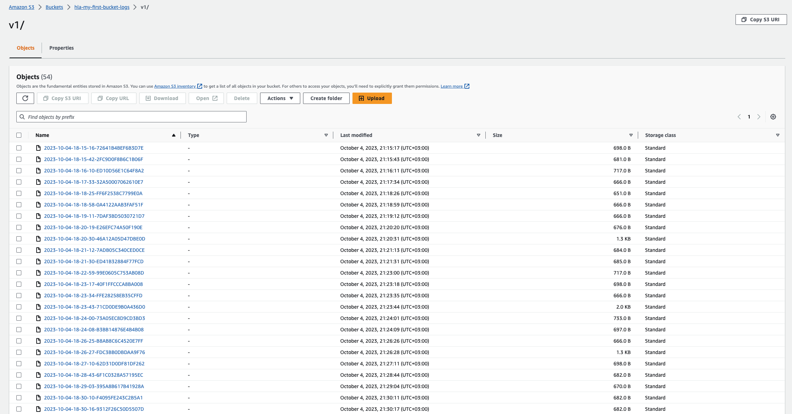

# hla28-aws-s3

## Simple Setup

Create S3 bucket where objects can’t be modified and all requests are logged.
### Enabling logging:
This one is simple. Enable logging in bucket configuration and specify target bucket different from logging one to avoid duplicate logging.


### File locking approach:
There are two approaches possible:
1) Use build in locking functionality. However S3 locking requires versioning to be enabled on this bucket. In general file version stays unmodifiable, on any change new version will be created or specific version will be marked as deleted.
2) Use permissions policy. Here we are using regular S3 bucket, but we restrict any altering actions for the specific file. Any change to file will be rejected with S3 access denied
#### Use build in locking functionality
```
// Bucket versioning configuration
vkartashov@MacBook-Pro-5 ~ % aws s3api get-bucket-versioning  --bucket hla-my-first-bucket       
{
    "Status": "Enabled",
    "MFADelete": "Disabled"
}
// Bucket lock configuration
vkartashov@MacBook-Pro-5 ~ % aws s3api get-object-lock-configuration --bucket hla-my-first-bucket
{
    "ObjectLockConfiguration": {
        "ObjectLockEnabled": "Enabled",
        "Rule": {
            "DefaultRetention": {
                "Mode": "COMPLIANCE",
                "Days": 30
            }
        }
    }
}
// S3 object configuration
// File is locked with ObjectLockLegalHoldStatus AND ObjectLockMode
vkartashov@MacBook-Pro-5 ~ % aws s3api head-object --bucket hla-my-first-bucket --key words.txt
{
    "AcceptRanges": "bytes",
    "LastModified": "2023-10-04T18:22:35+00:00",
    "ContentLength": 3864811,
    "ETag": "\"4a8f651543d3c826bec3b222a4a87013\"",
    "VersionId": "4vFf4YMvWt3Nm6jZzkUg1qXlBoJk9pY8",
    "ContentType": "text/plain",
    "ServerSideEncryption": "AES256",
    "Metadata": {},
    "ObjectLockMode": "COMPLIANCE",
    "ObjectLockRetainUntilDate": "2023-11-03T18:22:34.482000+00:00",
    "ObjectLockLegalHoldStatus": "ON"
}
// Delete object
vkartashov@MacBook-Pro-5 ~ % aws s3api delete-object --bucket hla-my-first-bucket --key words.txt    
{
    "DeleteMarker": true,
    "VersionId": "6MWTZMy.i3DCh8gs_5_kVCOIin9LBdyf"
}
// Get object
vkartashov@MacBook-Pro-5 ~ % aws s3api head-object --bucket hla-my-first-bucket --key words.txt  
// Object is deleted but version is stored in version list
An error occurred (404) when calling the HeadObject operation: Not Found

```
#### Use permissions policy
```
// Permission policies are defined for bucket to not allo any PUT or DELETE operations
vkartashov@MacBook-Pro-5 ~ % aws s3api get-bucket-policy --bucket hla-my-first-bucket-v1     
{
    "Policy": "{
        "Version":"2012-10-17",
        "Statement":[
          {
            "Sid":"PreventOverwriteExistingObject",
            "Effect":"Deny",
            "Principal":"*",
            "Action":["s3:PutObject","s3:DeleteObject"],
            "Resource":"arn:aws:s3:::hla-my-first-bucket-v1/words (2).txt"}
        ]
    }"
}
// No version configuration for bucket
vkartashov@MacBook-Pro-5 ~ % aws s3api get-bucket-versioning  --bucket hla-my-first-bucket-v1
// No lock configuration for bucket        
vkartashov@MacBook-Pro-5 ~ % aws s3api get-object-lock-configuration --bucket hla-my-first-bucket-v1
An error occurred (ObjectLockConfigurationNotFoundError) when calling the GetObjectLockConfiguration operation: Object Lock configuration does not exist for this bucket
// Not lock on object
vkartashov@MacBook-Pro-5 ~ % aws s3api head-object --bucket hla-my-first-bucket-v1 --key 'words (2).txt'
{
    "AcceptRanges": "bytes",
    "LastModified": "2023-10-04T18:02:29+00:00",
    "ContentLength": 3864811,
    "ETag": "\"4a8f651543d3c826bec3b222a4a87013\"",
    "ContentType": "text/plain",
    "ServerSideEncryption": "AES256",
    "Metadata": {}
}
// Try to delete object, but getting permission denied
vkartashov@MacBook-Pro-5 ~ % aws s3api delete-object --bucket hla-my-first-bucket-v1 --key 'words (2).txt'

An error occurred (AccessDenied) when calling the DeleteObject operation: Access Denied
```