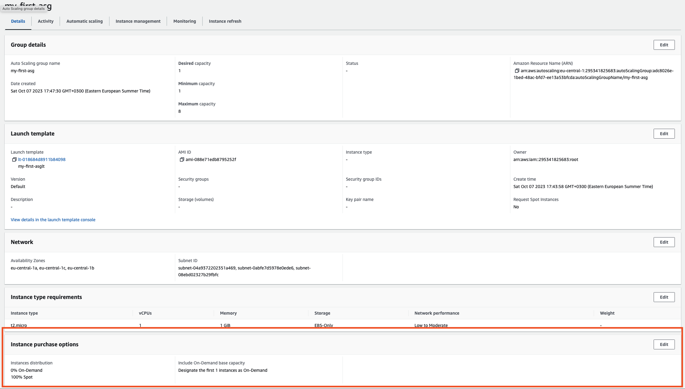
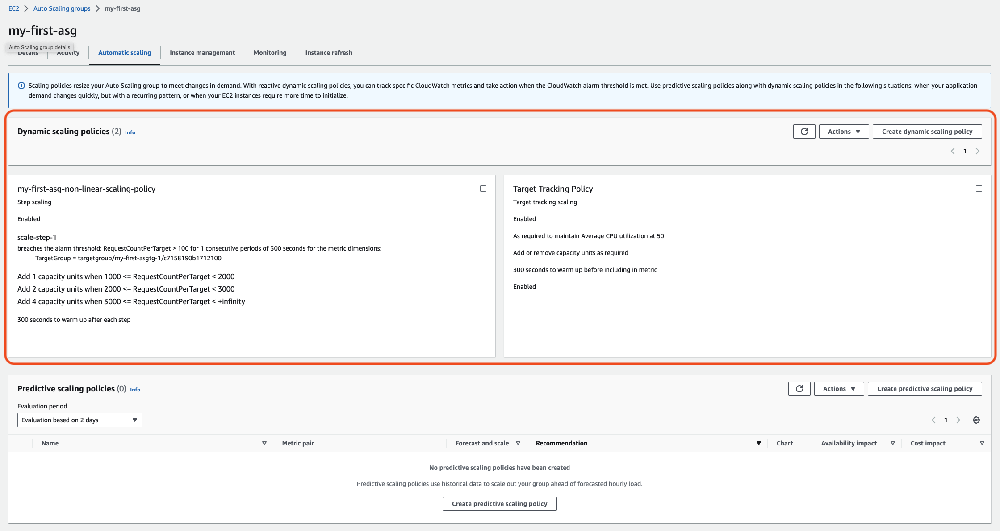

# hla30-aws-autoscale

## Scale It!

Create autoscale group that will contain one ondemand instance and will scale on spot instances.
Set up scaling policy based on AVG CPU usage
Set up scaling policy based on requests amount that allows non-linear growth

### Autoscale grouop
Pretty simple homework since it is not required to check if it is actually scaled per requirement.
To create an autoscale group with one ondemand instance and spot instances we need to skip chosing instance type
in autoscale group template. 

### Scaling policies
AVG CPU usage policies is very simple, it is possible to create it straight away
For non linear scaling policy we need to create cloudwatch metric for target group and specify non linear scale parameters
In our case with < 1000 requests for instance we will have 1 instance  
In our case with >= 1000 requests for instance we will have 2 instances  
In our case with >= 2000 requests for instance we will have 4 instances  
In our case with >= 3000 requests for instance we will have 8 instances  
